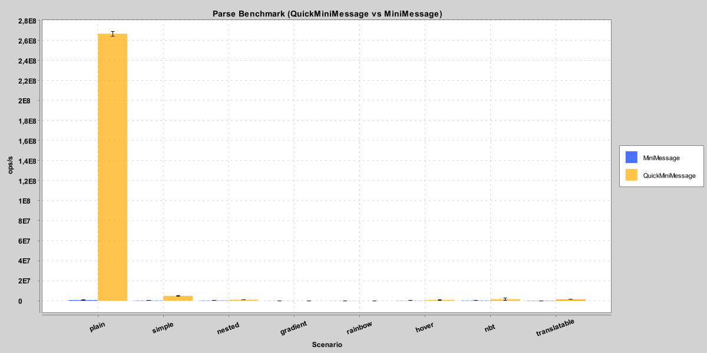
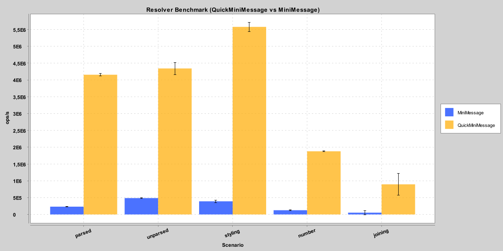

# QuickMiniMessage

QuickMiniMessage is a fast, allocation-conscious MiniMessage parser for Adventure Components. It focuses on the common
tag set and lightweight extensibility so you can parse chat-like templates at high throughput.

## What It Is For

- Fast MiniMessage-style parsing in hot paths (chat formatting, scoreboard lines, etc..).
- Drop-in alternative when full MiniMessage flexibility is not required.
- Small, direct API for custom tags and formatting helpers.

## Features

- Core MiniMessage tags: colors, decorations, gradients/rainbows, click/hover, insertion, font, key, NBT, selector,
  score, and more.
- Custom tags via `MMTagResolver`.
- Format helpers via `MMFormatter` (numbers, dates, choice, joining).
- Translatable component handling via `MMTranslator`.

## Installation

If you publish to the configured Maven repository, depend on the published coordinates:

```kotlin
repositories {
    maven("https://repo.nekroplex.com/releases")
}

dependencies {
    implementation("gg.aquatic:QuickMiniMessage:<version>")
}
```

## Usage

Basic parsing:

```kotlin
val component = MMParser.deserialize("<red>Hello</red> <bold>world</bold>")
```

Custom tag resolver:

```kotlin
val resolver = MMTagResolver.resolver("shout") { args, context ->
    val message = args.firstOrNull() ?: return@resolver null
    MMTag.inserting(context.deserialize(message.uppercase()))
}

val component = MMParser.deserialize("<shout:hello>", resolver)
```

Formatter helpers:

```kotlin
val resolver = MMTagResolver.resolver(
    MMFormatter.number("amount", 12345),
    MMFormatter.date("today", java.time.LocalDate.now())
)

val component = MMParser.deserialize("Paid <amount> on <today:yyyy-MM-dd>", resolver)
```

## Benchmarks

JMH results below come from `build/reports/jmh/results.json` on this machine (JDK 25.0.1, 1 fork, 3 warmup x 10s,
5 measurement x 1s, mode = throughput). Results vary by machine and input complexity.

### Parsing Scenarios

| Scenario     | QuickMiniMessage       | MiniMessage        | Speedup |
|--------------|------------------------|--------------------|---------|
| plain        | 112,775,021.24 ops/s   | 909,037.76 ops/s   | 124.1x  |
| simple       | 2,863,604.58 ops/s     | 291,353.07 ops/s   | 9.8x    |
| nested       | 2,081,179.07 ops/s     | 129,104.32 ops/s   | 16.1x   |
| gradient     | 57,589.83 ops/s        | 14,784.48 ops/s    | 3.9x    |
| rainbow      | 64,206.62 ops/s        | 18,831.82 ops/s    | 3.4x    |
| hover        | 1,124,064.33 ops/s     | 70,513.54 ops/s    | 15.9x   |
| nbt          | 1,667,070.91 ops/s     | 158,112.84 ops/s   | 10.5x   |
| translatable | 878,501.71 ops/s       | 48,536.56 ops/s    | 18.1x   |



### Resolver Scenarios

| Scenario | QuickMiniMessage     | MiniMessage        | Speedup |
|----------|----------------------|--------------------|---------|
| parsed   | 4,155,240.71 ops/s   | 232,270.92 ops/s   | 17.9x   |
| unparsed | 4,340,742.90 ops/s   | 487,208.89 ops/s   | 8.9x    |
| styling  | 5,576,573.43 ops/s   | 390,397.35 ops/s   | 14.3x   |
| number   | 1,878,860.44 ops/s   | 127,031.63 ops/s   | 14.8x   |
| joining  | 896,475.11 ops/s     | 53,166.22 ops/s    | 16.8x   |



### Run Benchmarks

```bash
./gradlew jmh
```

That command runs JMH and then generates PNG charts automatically.

### Outputs

- JMH JSON results: `build/reports/jmh/results.json`
- PNG charts: `docs/benchmarks/mmparserbenchmark.png`, `docs/benchmarks/mmparserresolverbenchmark.png`

Benchmark run settings (forks/iterations/time) are configured in the `jmh {}` block in `build.gradle.kts`.

### Regenerate Charts Only

If you already have `build/reports/jmh/results.json`, you can regenerate charts without re-running JMH:

```bash
./gradlew jmhGraphs
```
